# NeuroCore Architecture

> Comprehensive architecture reference for NeuroCore v0.3.0 — a pluggable,
> YAML-driven framework for building agentic AI applications.

---

## Table of Contents

- [NeuroCore Architecture](#neurocore-architecture)
  - [Table of Contents](#table-of-contents)
  - [1. System Overview](#1-system-overview)
  - [2. Layer Architecture](#2-layer-architecture)
  - [3. Package Structure](#3-package-structure)
  - [4. Class Diagram](#4-class-diagram)
  - [5. Data Models](#5-data-models)
    - [5.1 Blueprint Model](#51-blueprint-model)
    - [5.2 Configuration Model](#52-configuration-model)
    - [5.3 SkillMeta](#53-skillmeta)
    - [5.4 Persistence Model](#54-persistence-model)
  - [6. Error Hierarchy](#6-error-hierarchy)
  - [7. Configuration Flow](#7-configuration-flow)
  - [8. Config Merging](#8-config-merging)
  - [9. Skill Discovery Flow](#9-skill-discovery-flow)
  - [10. Skill Lifecycle](#10-skill-lifecycle)
  - [11. Blueprint Execution Flow](#11-blueprint-execution-flow)
  - [12. CLI Command Flow](#12-cli-command-flow)
  - [13. Plugin Architecture](#13-plugin-architecture)
  - [14. Component Interaction Matrix](#14-component-interaction-matrix)
  - [15. Key Design Decisions](#15-key-design-decisions)
  - [16. LLM Provider Subsystem](#16-llm-provider-subsystem)
  - [17. Persistence, Runs & Resume](#17-persistence-runs--resume)
  - [18. Human-in-the-Loop](#18-human-in-the-loop)

---

## 1. System Overview

NeuroCore sits between user applications and FlowEngine, adding skill metadata,
configuration management, discovery, and a CLI on top of FlowEngine's workflow
orchestration.

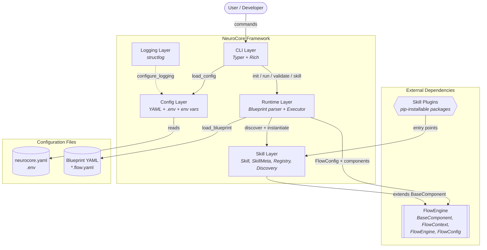
```mermaid
graph TD
    User([User / Developer])

    subgraph NeuroCore["NeuroCore Framework"]
        CLI["CLI Layer<br/><i>Typer + Rich</i>"]
        Runtime["Runtime Layer<br/><i>Blueprint parser + Executor</i>"]
        SkillSys["Skill Layer<br/><i>Skill, SkillMeta, Registry, Discovery</i>"]
        Config["Config Layer<br/><i>YAML + .env + env vars</i>"]
        Logging["Logging Layer<br/><i>structlog</i>"]
    end

    subgraph External["External Dependencies"]
        FE[["FlowEngine<br/><i>BaseComponent, FlowContext,<br/>FlowEngine, FlowConfig</i>"]]
        Plugins{{"Skill Plugins<br/><i>pip-installable packages</i>"}}
    end

    subgraph Files["Configuration Files"]
        YAML[("neurocore.yaml<br/>.env")]
        Blueprints[("Blueprint YAML<br/>*.flow.yaml")]
    end

    User -->|commands| CLI
    CLI -->|init / run / validate / skill| Runtime
    CLI -->|load_config| Config
    Runtime -->|discover + instantiate| SkillSys
    Runtime -->|FlowConfig + components| FE
    SkillSys -->|extends BaseComponent| FE
    Config -->|reads| YAML
    Runtime -->|load_blueprint| Blueprints
    Plugins -->|entry points| SkillSys
    Logging -.->|configure_logging| Config
```

---

## 2. Layer Architecture

Each layer depends only on layers below it. No circular dependencies.

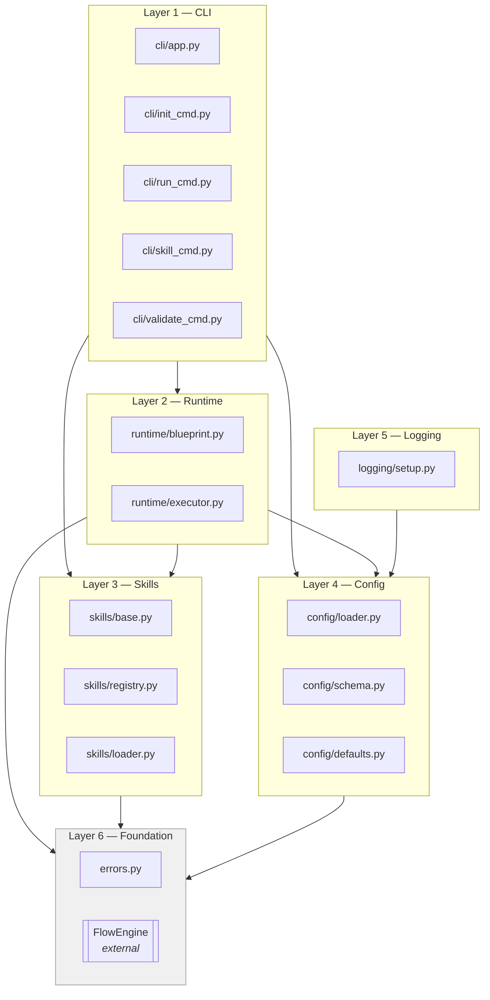
```mermaid
graph TD
    subgraph L1["Layer 1 — CLI"]
        app["cli/app.py"]
        init_cmd["cli/init_cmd.py"]
        run_cmd["cli/run_cmd.py"]
        skill_cmd["cli/skill_cmd.py"]
        validate_cmd["cli/validate_cmd.py"]
    end

    subgraph L2["Layer 2 — Runtime"]
        blueprint["runtime/blueprint.py"]
        executor["runtime/executor.py"]
    end

    subgraph L3["Layer 3 — Skills"]
        base["skills/base.py"]
        registry["skills/registry.py"]
        loader["skills/loader.py"]
    end

    subgraph L4["Layer 4 — Config"]
        cfg_loader["config/loader.py"]
        schema["config/schema.py"]
        defaults["config/defaults.py"]
    end

    subgraph L5["Layer 5 — Logging"]
        log_setup["logging/setup.py"]
    end

    subgraph L6["Layer 6 — Foundation"]
        errors["errors.py"]
        flowengine[["FlowEngine<br/><i>external</i>"]]
    end

    L1 --> L2
    L1 --> L3
    L1 --> L4
    L2 --> L3
    L2 --> L4
    L2 --> L6
    L3 --> L6
    L4 --> L6
    L5 --> L4

    style L6 fill:#f0f0f0,stroke:#999
```

| Layer | Package | Key Exports | External Dependencies |
|-------|---------|-------------|----------------------|
| CLI | `neurocore.cli` | `app`, `init_project`, `new_project`, `run_blueprint`, `skill_list`/`skill_info`, `validate_blueprint_cmd`, `runs_app`, `mcp_app` | typer, rich |
| Runtime | `neurocore.runtime` | `Blueprint`, `load_blueprint()`, `validate_blueprint()`, `execute_blueprint()`, `execute_blueprint_tracked()`, `resume_blueprint()`, `load_and_run()`, `merge_skill_config()` | flowengine |
| Skills | `neurocore.skills` | `Skill`, `AsyncSkill`, `SkillMeta`, `SkillRegistry`, `discover_skills()`, built-in `ApprovalSkill` | flowengine |
| LLM | `neurocore.llm` | `LLMProvider`, `AnthropicProvider`, `OpenAIProvider`, `GeminiProvider`, `LiteLLMProvider`, `MockProvider`, `build_provider()` | anthropic; openai/google-genai/litellm (optional) |
| Persistence | `neurocore.persistence` | `RunStore`, `SQLiteRunStore`, `InMemoryRunStore`, `RunRecord`, `StepRecord`, `RunStatus`, `build_run_store()`, `checkpoint_store_for()` | _(stdlib sqlite3)_ |
| Scaffold | `neurocore.scaffold` | `render_template()`, `render_tree()`, `TemplateSpec`, `TEMPLATES` | _(none)_ |
| Config | `neurocore.config` | `NeuroCoreConfig`, `ProjectConfig`, `PathsConfig`, `LoggingConfig`, `LLMConfig`, `PersistenceConfig`, `load_config()`, `find_project_root()` | pydantic, pyyaml, python-dotenv |
| Logging | `neurocore.logging` | `configure_logging()`, `get_logger()`, `reset_logging()` | structlog |
| Foundation | `neurocore.errors` | `NeuroCoreError`, `ConfigError`, `SkillError`, `BlueprintError`, `ExecutionError` | _(none)_ |

---

## 3. Package Structure

Module-level dependency graph. Dashed lines indicate lazy imports (inside function bodies).

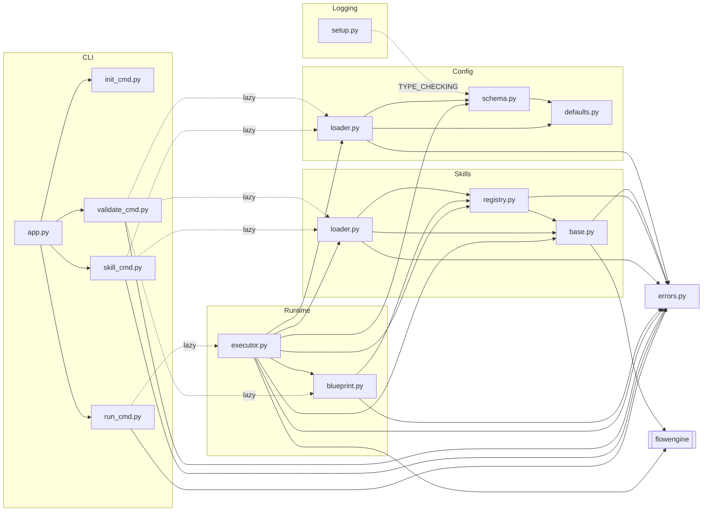
```mermaid
graph LR
    subgraph CLI
        app["app.py"]
        init["init_cmd.py"]
        run["run_cmd.py"]
        skill["skill_cmd.py"]
        val["validate_cmd.py"]
    end

    subgraph Runtime
        bp["blueprint.py"]
        exec["executor.py"]
    end

    subgraph Skills
        base["base.py"]
        reg["registry.py"]
        ldr["loader.py"]
    end

    subgraph Config
        cfgl["loader.py"]
        sch["schema.py"]
        dfl["defaults.py"]
    end

    subgraph Logging
        logsetup["setup.py"]
    end

    errors["errors.py"]
    fe[["flowengine"]]

    app --> init
    app --> run
    app --> skill
    app --> val

    run -.->|lazy| exec
    run --> errors
    skill -.->|lazy| cfgl
    skill -.->|lazy| ldr
    skill --> errors
    val -.->|lazy| cfgl
    val -.->|lazy| ldr
    val -.->|lazy| bp
    val --> errors

    exec --> cfgl
    exec --> sch
    exec --> bp
    exec --> base
    exec --> ldr
    exec --> reg
    exec --> errors
    exec --> fe

    bp --> reg
    bp --> errors

    ldr --> base
    ldr --> reg
    ldr --> errors

    reg --> base
    reg --> errors

    base --> errors
    base --> fe

    cfgl --> dfl
    cfgl --> sch
    cfgl --> errors

    sch --> dfl

    logsetup -.->|TYPE_CHECKING| sch
```

---

## 4. Class Diagram

Core classes, their inheritance relationships, and key methods.

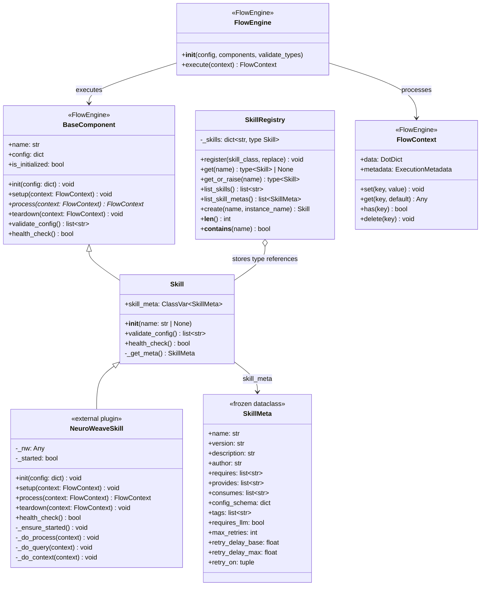
```mermaid
classDiagram
    class BaseComponent {
        <<FlowEngine>>
        +name: str
        +config: dict
        +is_initialized: bool
        +init(config: dict) void
        +setup(context: FlowContext) void
        +process(context: FlowContext)* FlowContext
        +teardown(context: FlowContext) void
        +validate_config() list~str~
        +health_check() bool
    }

    class Skill {
        +skill_meta: ClassVar~SkillMeta~
        +__init__(name: str | None)
        +validate_config() list~str~
        +health_check() bool
        -_get_meta() SkillMeta
    }

    class NeuroWeaveSkill {
        <<external plugin>>
        -_nw: Any
        -_started: bool
        +init(config: dict) void
        +setup(context: FlowContext) void
        +process(context: FlowContext) FlowContext
        +teardown(context: FlowContext) void
        +health_check() bool
        -_ensure_started() void
        -_do_process(context) void
        -_do_query(context) void
        -_do_context(context) void
    }

    class SkillMeta {
        <<frozen dataclass>>
        +name: str
        +version: str
        +description: str
        +author: str
        +requires: list~str~
        +provides: list~str~
        +consumes: list~str~
        +config_schema: dict
        +tags: list~str~
        +requires_llm: bool
        +max_retries: int
        +retry_delay_base: float
        +retry_delay_max: float
        +retry_on: tuple
    }

    class SkillRegistry {
        -_skills: dict~str, type Skill~
        +register(skill_class, replace) void
        +get(name) type~Skill~ | None
        +get_or_raise(name) type~Skill~
        +list_skills() list~str~
        +list_skill_metas() list~SkillMeta~
        +create(name, instance_name) Skill
        +__len__() int
        +__contains__(name) bool
    }

    class FlowContext {
        <<FlowEngine>>
        +data: DotDict
        +metadata: ExecutionMetadata
        +set(key, value) void
        +get(key, default) Any
        +has(key) bool
        +delete(key) void
    }

    class FlowEngine {
        <<FlowEngine>>
        +__init__(config, components, validate_types)
        +execute(context) FlowContext
    }

    BaseComponent <|-- Skill
    Skill <|-- NeuroWeaveSkill
    Skill --> SkillMeta : skill_meta
    SkillRegistry o-- Skill : stores type references
    FlowEngine --> BaseComponent : executes
    FlowEngine --> FlowContext : processes
```

---

## 5. Data Models

### 5.1 Blueprint Model

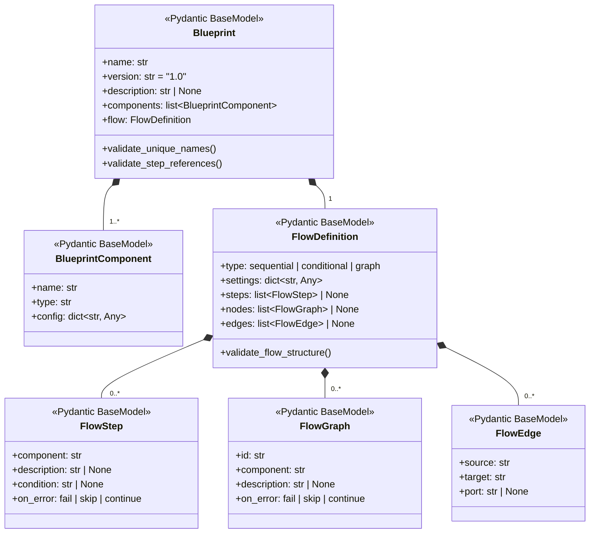
```mermaid
classDiagram
    class Blueprint {
        <<Pydantic BaseModel>>
        +name: str
        +version: str = "1.0"
        +description: str | None
        +components: list~BlueprintComponent~
        +flow: FlowDefinition
        +validate_unique_names()
        +validate_step_references()
    }

    class BlueprintComponent {
        <<Pydantic BaseModel>>
        +name: str
        +type: str
        +config: dict~str, Any~
    }

    class FlowDefinition {
        <<Pydantic BaseModel>>
        +type: sequential | conditional | graph
        +settings: dict~str, Any~
        +steps: list~FlowStep~ | None
        +nodes: list~FlowGraph~ | None
        +edges: list~FlowEdge~ | None
        +validate_flow_structure()
    }

    class FlowStep {
        <<Pydantic BaseModel>>
        +component: str
        +description: str | None
        +condition: str | None
        +on_error: fail | skip | continue
    }

    class FlowGraph {
        <<Pydantic BaseModel>>
        +id: str
        +component: str
        +description: str | None
        +on_error: fail | skip | continue
    }

    class FlowEdge {
        <<Pydantic BaseModel>>
        +source: str
        +target: str
        +port: str | None
    }

    Blueprint *-- "1..*" BlueprintComponent
    Blueprint *-- "1" FlowDefinition
    FlowDefinition *-- "0..*" FlowStep
    FlowDefinition *-- "0..*" FlowGraph
    FlowDefinition *-- "0..*" FlowEdge
```

### 5.2 Configuration Model

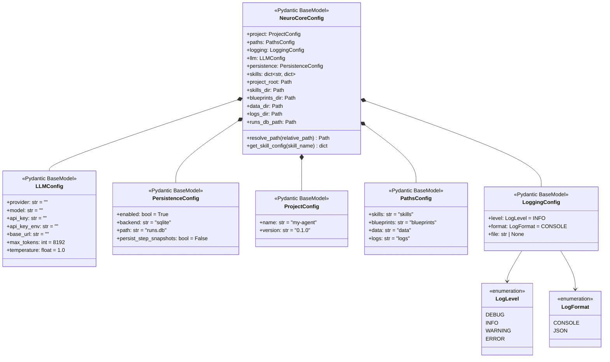
```mermaid
classDiagram
    class NeuroCoreConfig {
        <<Pydantic BaseModel>>
        +project: ProjectConfig
        +paths: PathsConfig
        +logging: LoggingConfig
        +llm: LLMConfig
        +persistence: PersistenceConfig
        +skills: dict~str, dict~
        +project_root: Path
        +resolve_path(relative_path) Path
        +get_skill_config(skill_name) dict
        +skills_dir: Path
        +blueprints_dir: Path
        +data_dir: Path
        +logs_dir: Path
        +runs_db_path: Path
    }

    class LLMConfig {
        <<Pydantic BaseModel>>
        +provider: str = ""
        +model: str = ""
        +api_key: str = ""
        +api_key_env: str = ""
        +base_url: str = ""
        +max_tokens: int = 8192
        +temperature: float = 1.0
    }

    class PersistenceConfig {
        <<Pydantic BaseModel>>
        +enabled: bool = True
        +backend: str = "sqlite"
        +path: str = "runs.db"
        +persist_step_snapshots: bool = False
    }

    class ProjectConfig {
        <<Pydantic BaseModel>>
        +name: str = "my-agent"
        +version: str = "0.1.0"
    }

    class PathsConfig {
        <<Pydantic BaseModel>>
        +skills: str = "skills"
        +blueprints: str = "blueprints"
        +data: str = "data"
        +logs: str = "logs"
    }

    class LoggingConfig {
        <<Pydantic BaseModel>>
        +level: LogLevel = INFO
        +format: LogFormat = CONSOLE
        +file: str | None
    }

    class LogLevel {
        <<enumeration>>
        DEBUG
        INFO
        WARNING
        ERROR
    }

    class LogFormat {
        <<enumeration>>
        CONSOLE
        JSON
    }

    NeuroCoreConfig *-- ProjectConfig
    NeuroCoreConfig *-- PathsConfig
    NeuroCoreConfig *-- LoggingConfig
    NeuroCoreConfig *-- LLMConfig
    NeuroCoreConfig *-- PersistenceConfig
    LoggingConfig --> LogLevel
    LoggingConfig --> LogFormat
```

### 5.3 SkillMeta

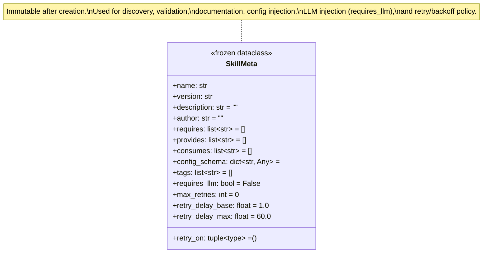
```mermaid
classDiagram
    class SkillMeta {
        <<frozen dataclass>>
        +name: str
        +version: str
        +description: str = ""
        +author: str = ""
        +requires: list~str~ = []
        +provides: list~str~ = []
        +consumes: list~str~ = []
        +config_schema: dict~str, Any~ =
        +tags: list~str~ = []
        +requires_llm: bool = False
        +max_retries: int = 0
        +retry_delay_base: float = 1.0
        +retry_delay_max: float = 60.0
        +retry_on: tuple~type~ = ()
    }

    note for SkillMeta "Immutable after creation.\nUsed for discovery, validation,\ndocumentation, config injection,\nLLM injection (requires_llm),\nand retry/backoff policy."
```

### 5.4 Persistence Model

Every tracked run is recorded as a `RunRecord` plus an ordered list of
`StepRecord`s via the `RunStore` interface.

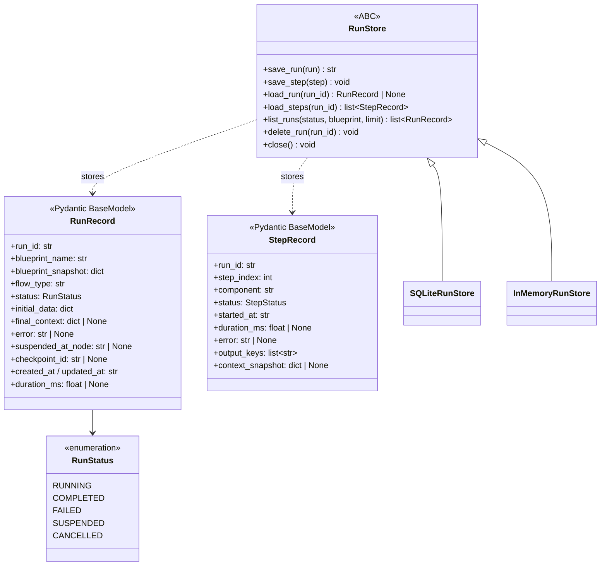
```mermaid
classDiagram
    class RunStore {
        <<ABC>>
        +save_run(run) str
        +save_step(step) void
        +load_run(run_id) RunRecord | None
        +load_steps(run_id) list~StepRecord~
        +list_runs(status, blueprint, limit) list~RunRecord~
        +delete_run(run_id) void
        +close() void
    }

    class RunRecord {
        <<Pydantic BaseModel>>
        +run_id: str
        +blueprint_name: str
        +blueprint_snapshot: dict
        +flow_type: str
        +status: RunStatus
        +initial_data: dict
        +final_context: dict | None
        +error: str | None
        +suspended_at_node: str | None
        +checkpoint_id: str | None
        +created_at / updated_at: str
        +duration_ms: float | None
    }

    class StepRecord {
        <<Pydantic BaseModel>>
        +run_id: str
        +step_index: int
        +component: str
        +status: StepStatus
        +started_at: str
        +duration_ms: float | None
        +error: str | None
        +output_keys: list~str~
        +context_snapshot: dict | None
    }

    class RunStatus {
        <<enumeration>>
        RUNNING
        COMPLETED
        FAILED
        SUSPENDED
        CANCELLED
    }

    RunStore <|-- SQLiteRunStore
    RunStore <|-- InMemoryRunStore
    RunStore ..> RunRecord : stores
    RunStore ..> StepRecord : stores
    RunRecord --> RunStatus
```

`SQLiteRunStore` (default) persists to `<data_dir>/runs.db` using only the stdlib
`sqlite3` module (tables: `runs`, `steps`, `checkpoints`). A `RunStore` can also
back flowengine's `CheckpointStore` (sync suspend/resume) via
`checkpoint_store_for()`.

---

## 6. Error Hierarchy

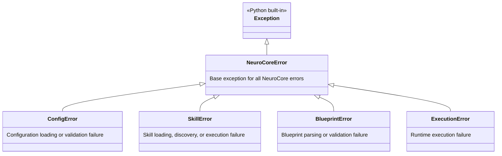
```mermaid
classDiagram
    class Exception {
        <<Python built-in>>
    }

    class NeuroCoreError {
        Base exception for all NeuroCore errors
    }

    class ConfigError {
        Configuration loading or validation failure
    }

    class SkillError {
        Skill loading, discovery, or execution failure
    }

    class BlueprintError {
        Blueprint parsing or validation failure
    }

    class ExecutionError {
        Runtime execution failure
    }

    Exception <|-- NeuroCoreError
    NeuroCoreError <|-- ConfigError
    NeuroCoreError <|-- SkillError
    NeuroCoreError <|-- BlueprintError
    NeuroCoreError <|-- ExecutionError
```

| Exception | Raised By | Typical Causes |
|-----------|-----------|----------------|
| `ConfigError` | `config/loader.py` | YAML parse failure, missing config file, invalid config structure |
| `SkillError` | `skills/base.py`, `skills/registry.py`, `skills/loader.py` | Missing `skill_meta`, duplicate registration, import failure, unknown skill |
| `BlueprintError` | `runtime/blueprint.py`, `runtime/executor.py` | Invalid YAML, missing components/flow, unknown skill type reference, config validation failure |
| `ExecutionError` | `runtime/executor.py` | FlowEngine creation failure, runtime error during flow execution |

---

## 7. Configuration Flow

How `load_config()` assembles a `NeuroCoreConfig` from multiple sources.

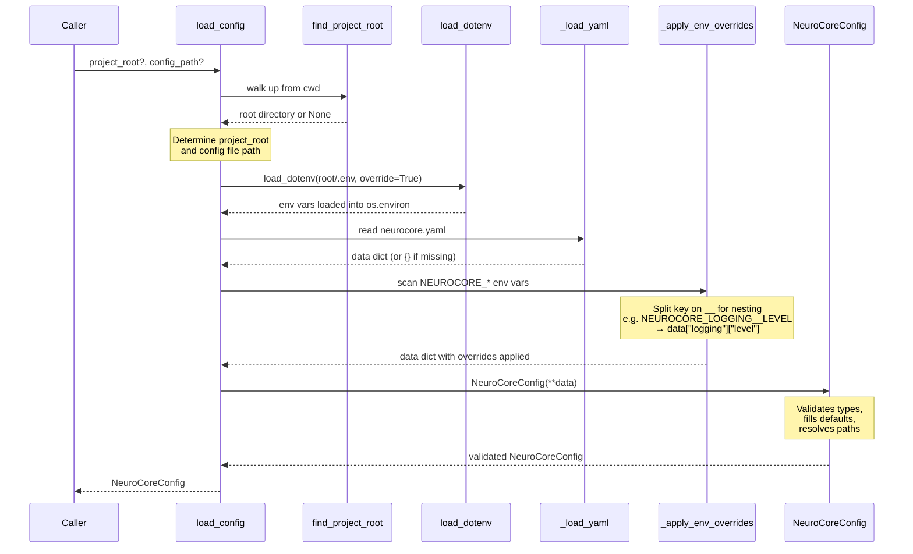
```mermaid
sequenceDiagram
    participant Caller
    participant load_config
    participant find_project_root
    participant dotenv as load_dotenv
    participant load_yaml as _load_yaml
    participant env_overrides as _apply_env_overrides
    participant Pydantic as NeuroCoreConfig

    Caller->>load_config: project_root?, config_path?
    load_config->>find_project_root: walk up from cwd
    find_project_root-->>load_config: root directory or None

    Note over load_config: Determine project_root<br/>and config file path

    load_config->>dotenv: load_dotenv(root/.env, override=True)
    dotenv-->>load_config: env vars loaded into os.environ

    load_config->>load_yaml: read neurocore.yaml
    load_yaml-->>load_config: data dict (or {} if missing)

    load_config->>env_overrides: scan NEUROCORE_* env vars
    Note over env_overrides: Split key on __ for nesting<br/>e.g. NEUROCORE_LOGGING__LEVEL<br/>→ data["logging"]["level"]
    env_overrides-->>load_config: data dict with overrides applied

    load_config->>Pydantic: NeuroCoreConfig(**data)
    Note over Pydantic: Validates types,<br/>fills defaults,<br/>resolves paths
    Pydantic-->>load_config: validated NeuroCoreConfig

    load_config-->>Caller: NeuroCoreConfig
```

| Priority | Source | Example | Mechanism |
|----------|--------|---------|-----------|
| 1 (highest) | Environment variables | `NEUROCORE_LOGGING__LEVEL=DEBUG` | `_apply_env_overrides()` scans `os.environ` |
| 2 | `.env` file | `NEUROCORE_LOGGING__LEVEL=DEBUG` in `.env` | `python-dotenv load_dotenv(override=True)` |
| 3 | `neurocore.yaml` | `logging: level: INFO` | `yaml.safe_load()` |
| 4 (lowest) | Built-in defaults | `DEFAULT_LOG_LEVEL = "INFO"` | Constants in `config/defaults.py`, applied by Pydantic |

---

## 8. Config Merging

How skill configuration is assembled from two sources before being passed to `skill.init()`.

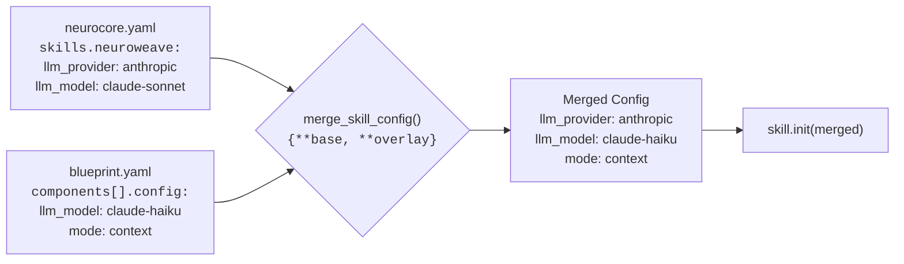
```mermaid
graph LR
    A["neurocore.yaml<br/><code>skills.neuroweave:</code><br/>llm_provider: anthropic<br/>llm_model: claude-sonnet"] --> C{"merge_skill_config()<br/><code>{**base, **overlay}</code>"}
    B["blueprint.yaml<br/><code>components[].config:</code><br/>llm_model: claude-haiku<br/>mode: context"] --> C
    C --> D["Merged Config<br/>llm_provider: anthropic<br/>llm_model: claude-haiku<br/>mode: context"]
    D --> E["skill.init(merged)"]
```

The merge is a **shallow dict merge** — blueprint values win for overlapping keys.

| Key | `neurocore.yaml` (base) | `blueprint` (overlay) | Merged result |
|-----|------------------------|----------------------|---------------|
| `llm_provider` | `"anthropic"` | _(not set)_ | `"anthropic"` |
| `llm_model` | `"claude-sonnet-4-20250514"` | `"claude-haiku-4-5-20251001"` | `"claude-haiku-4-5-20251001"` |
| `mode` | _(not set)_ | `"context"` | `"context"` |

---

## 9. Skill Discovery Flow

Two-phase discovery: directory scan first (lower priority), then entry points (higher priority, with `replace=True`).

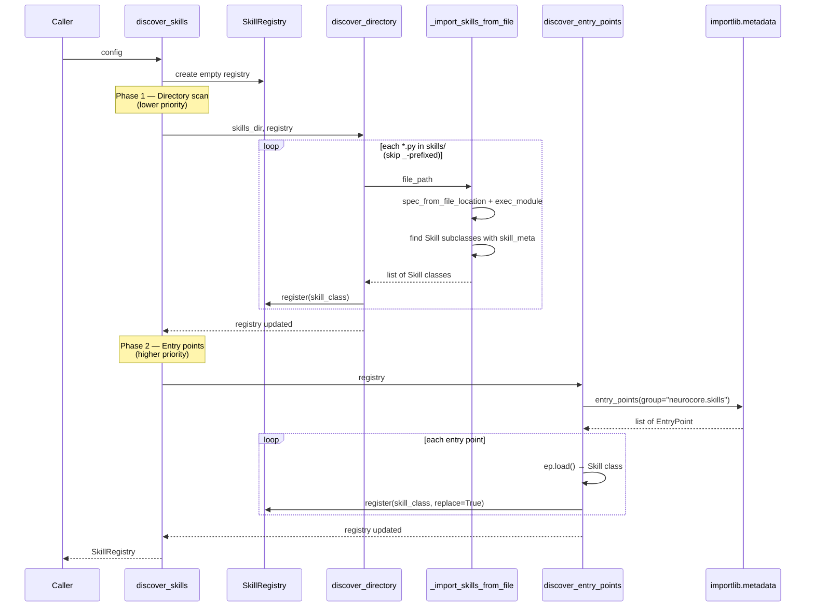
```mermaid
sequenceDiagram
    participant Caller
    participant discover_skills
    participant Registry as SkillRegistry
    participant discover_dir as discover_directory
    participant import_file as _import_skills_from_file
    participant discover_ep as discover_entry_points
    participant importlib as importlib.metadata

    Caller->>discover_skills: config
    discover_skills->>Registry: create empty registry

    Note over discover_skills: Phase 1 — Directory scan<br/>(lower priority)
    discover_skills->>discover_dir: skills_dir, registry
    loop each *.py in skills/ (skip _-prefixed)
        discover_dir->>import_file: file_path
        import_file->>import_file: spec_from_file_location + exec_module
        import_file->>import_file: find Skill subclasses with skill_meta
        import_file-->>discover_dir: list of Skill classes
        discover_dir->>Registry: register(skill_class)
    end
    discover_dir-->>discover_skills: registry updated

    Note over discover_skills: Phase 2 — Entry points<br/>(higher priority)
    discover_skills->>discover_ep: registry
    discover_ep->>importlib: entry_points(group="neurocore.skills")
    importlib-->>discover_ep: list of EntryPoint
    loop each entry point
        discover_ep->>discover_ep: ep.load() → Skill class
        discover_ep->>Registry: register(skill_class, replace=True)
    end
    discover_ep-->>discover_skills: registry updated

    discover_skills-->>Caller: SkillRegistry
```

| Phase | Source | Import Mechanism | Precedence |
|-------|--------|-----------------|------------|
| 1 | `skills/` directory | `importlib.util.spec_from_file_location()` per `.py` file | Lower (registered first, no replace) |
| 2 | Entry points | `importlib.metadata.entry_points(group="neurocore.skills")` | Higher (`replace=True` overwrites Phase 1) |

---

## 10. Skill Lifecycle

A Skill follows FlowEngine's `BaseComponent` lifecycle. `init()` is called once;
`setup()` → `process()` → `teardown()` are called per run.

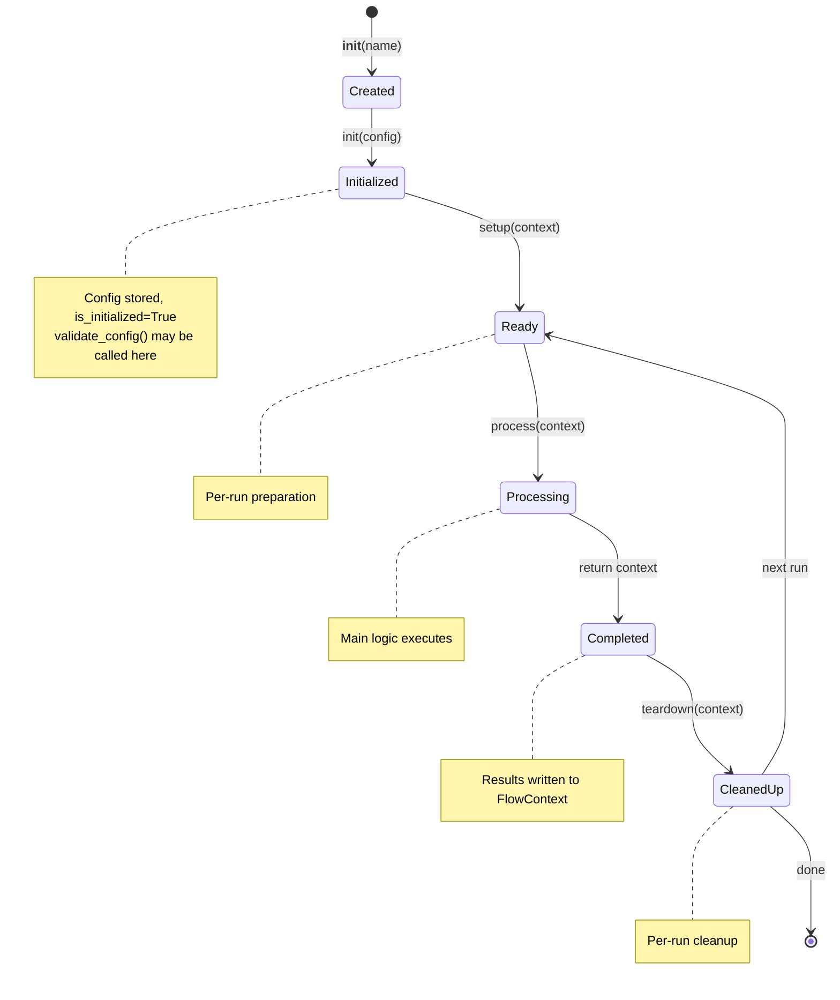
```mermaid
stateDiagram-v2
    [*] --> Created : __init__(name)

    Created --> Initialized : init(config)
    note right of Initialized : Config stored, is_initialized=True<br/>validate_config() may be called here

    Initialized --> Ready : setup(context)
    note right of Ready : Per-run preparation

    Ready --> Processing : process(context)
    note right of Processing : Main logic executes

    Processing --> Completed : return context
    note right of Completed : Results written to FlowContext

    Completed --> CleanedUp : teardown(context)
    note right of CleanedUp : Per-run cleanup

    CleanedUp --> Ready : next run
    CleanedUp --> [*] : done
```

| Method | Frequency | Required | Purpose |
|--------|-----------|----------|---------|
| `__init__(name)` | Once | Yes (inherited) | Instance creation; name defaults to `skill_meta.name` |
| `init(config)` | Once | Override optional | Store config, connect to services, load models |
| `setup(context)` | Per run | Override optional | Per-run preparation (e.g., lazy start) |
| `process(context)` | Per run | **Must implement** | Main logic: read from context, do work, write results |
| `teardown(context)` | Per run | Override optional | Cleanup, close connections |
| `validate_config()` | After init | Override optional | Return `list[str]` of errors; checks JSON Schema by default |
| `health_check()` | On demand | Override optional | Return `bool`; checks `is_initialized` by default |

---

## 11. Blueprint Execution Flow

The complete `load_and_run()` pipeline from file path to `FlowContext` result.

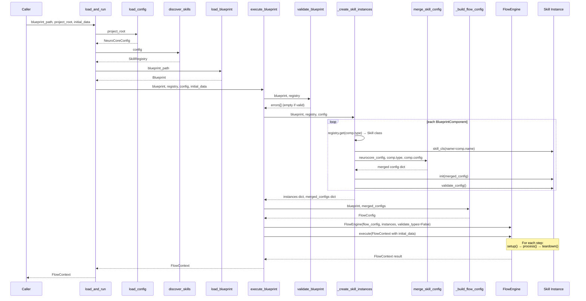
```mermaid
sequenceDiagram
    participant Caller
    participant load_and_run
    participant load_config
    participant discover_skills
    participant load_blueprint
    participant execute_bp as execute_blueprint
    participant validate_bp as validate_blueprint
    participant createX as _create_skill_instances
    participant merge as merge_skill_config
    participant build as _build_flow_config
    participant FE as FlowEngine
    participant Skill as Skill Instance

    Caller->>load_and_run: blueprint_path, project_root, initial_data

    load_and_run->>load_config: project_root
    load_config-->>load_and_run: NeuroCoreConfig

    load_and_run->>discover_skills: config
    discover_skills-->>load_and_run: SkillRegistry

    load_and_run->>load_blueprint: blueprint_path
    load_blueprint-->>load_and_run: Blueprint

    load_and_run->>execute_bp: blueprint, registry, config, initial_data

    execute_bp->>validate_bp: blueprint, registry
    validate_bp-->>execute_bp: errors[] (empty if valid)

    execute_bp->>createX: blueprint, registry, config
    loop each BlueprintComponent
        createX->>createX: registry.get(comp.type) → Skill class
        createX->>Skill: skill_cls(name=comp.name)
        createX->>merge: neurocore_config, comp.type, comp.config
        merge-->>createX: merged config dict
        createX->>Skill: init(merged_config)
        createX->>Skill: validate_config()
    end
    createX-->>execute_bp: instances dict, merged_configs dict

    execute_bp->>build: blueprint, merged_configs
    build-->>execute_bp: FlowConfig

    execute_bp->>FE: FlowEngine(flow_config, instances, validate_types=False)
    execute_bp->>FE: execute(FlowContext with initial_data)

    Note over FE,Skill: For each step:<br/>setup() → process() → teardown()

    FE-->>execute_bp: FlowContext result
    execute_bp-->>load_and_run: FlowContext
    load_and_run-->>Caller: FlowContext
```

### 11.1 Retry / Backoff Mechanism

When a skill's `SkillMeta` declares retry fields, the executor automatically
wraps the skill's `process()` call with exponential backoff:

| `SkillMeta` Field | Type | Default | Description |
| ----------------- | ---- | ------- | ----------- |
| `max_retries` | `int` | `0` | Maximum number of retry attempts (0 = no retries) |
| `retry_delay_base` | `float` | `1.0` | Initial delay in seconds before the first retry |
| `retry_delay_max` | `float` | `60.0` | Upper bound on the delay between retries |
| `retry_on` | `list[str]` | `[]` | Exception class names that trigger a retry (empty = retry on any exception) |

The delay between retries grows exponentially: `min(retry_delay_base * 2^attempt, retry_delay_max)`.
If all retries are exhausted, the last exception propagates as an `ExecutionError`.

### 11.2 Graph Execution Routing (hybrid)

`graph` flows are routed by `_graph_needs_executor()`:

| Graph uses… | Executor | Why |
|-------------|----------|-----|
| edge `port`s, edge `condition`s, or a cycle | flowengine `GraphExecutor` (`execute_async` when any skill is async) | honors port/condition gating and cyclic `max_iterations` |
| none of the above (plain DAG) | NeuroCore `_execute_dag_concurrent` | runs independent nodes concurrently via `asyncio.gather` |

Both paths populate `metadata.completed_nodes` and step timings, so run tracking,
resume, and the `runs` CLI behave identically. Edge conditions are safe Python
expressions over `context` (e.g. `context.data.score > 0.5`) evaluated by
flowengine's `ConditionEvaluator`. Requires `flowengine>=0.6.0`.

---

## 12. CLI Command Flow

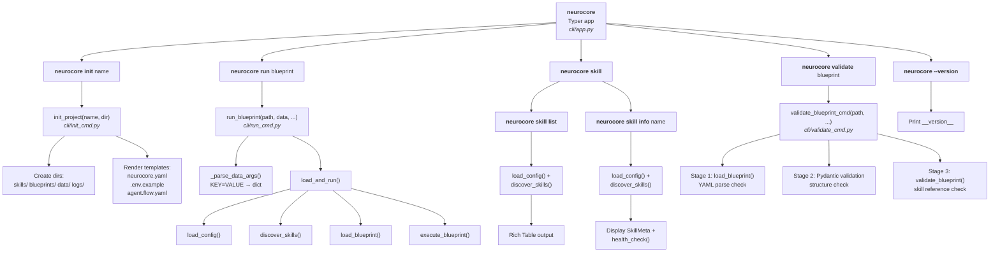
```mermaid
flowchart TD
    CLI["<b>neurocore</b><br/>Typer app<br/><i>cli/app.py</i>"]

    CLI --> Init["<b>neurocore init</b> name"]
    CLI --> Run["<b>neurocore run</b> blueprint"]
    CLI --> SkillCmd["<b>neurocore skill</b>"]
    CLI --> Validate["<b>neurocore validate</b> blueprint"]
    CLI --> Version["<b>neurocore --version</b>"]

    Init --> InitFn["init_project(name, dir)<br/><i>cli/init_cmd.py</i>"]
    InitFn --> MkDirs["Create dirs:<br/>skills/ blueprints/ data/ logs/"]
    InitFn --> RenderTpl["Render templates:<br/>neurocore.yaml<br/>.env.example<br/>agent.flow.yaml"]

    Run --> RunFn["run_blueprint(path, data, ...)<br/><i>cli/run_cmd.py</i>"]
    RunFn --> ParseData["_parse_data_args()<br/>KEY=VALUE → dict"]
    RunFn --> LAR["load_and_run()"]
    LAR --> LC["load_config()"]
    LAR --> DS["discover_skills()"]
    LAR --> LB["load_blueprint()"]
    LAR --> EB["execute_blueprint()"]

    SkillCmd --> SList["<b>neurocore skill list</b>"]
    SkillCmd --> SInfo["<b>neurocore skill info</b> name"]
    SList --> Disc1["load_config() +<br/>discover_skills()"]
    Disc1 --> Table["Rich Table output"]
    SInfo --> Disc2["load_config() +<br/>discover_skills()"]
    Disc2 --> Meta["Display SkillMeta +<br/>health_check()"]

    Validate --> ValFn["validate_blueprint_cmd(path, ...)<br/><i>cli/validate_cmd.py</i>"]
    ValFn --> S1["Stage 1: load_blueprint()<br/>YAML parse check"]
    ValFn --> S2["Stage 2: Pydantic validation<br/>structure check"]
    ValFn --> S3["Stage 3: validate_blueprint()<br/>skill reference check"]

    Version --> VerFn["Print __version__"]
```

| Command | Function | Module | Key Calls |
|---------|----------|--------|-----------|
| `neurocore init <name>` | `init_project()` | `cli/init_cmd.py` | Template rendering, directory creation |
| `neurocore new <template> <name>` | `new_project()` | `cli/new_cmd.py` | `scaffold.registry`, `render_tree()` |
| `neurocore run <blueprint>` | `run_blueprint()` | `cli/run_cmd.py` | `_parse_data_args()`, `load_and_run()`, `--stream` renderer |
| `neurocore skill list` / `info` | `skill_list()` / `skill_info()` | `cli/skill_cmd.py` | `load_config()`, `discover_skills()` |
| `neurocore validate <blueprint>` | `validate_blueprint_cmd()` | `cli/validate_cmd.py` | `load_blueprint()`, `discover_skills()`, `validate_blueprint()` |
| `neurocore runs list/inspect/replay/resume/approve` | `runs_app` | `cli/runs_cmd.py` | `build_run_store()`, `execute_blueprint_tracked()`, `resume_blueprint()` |
| `neurocore mcp list-tools/call` | `mcp_app` | `cli/mcp_cmd.py` | lazy `neurocore_skill_mcp.client` |
| `neurocore --version` | `version_callback()` | `cli/app.py` | Print `neurocore.__version__` |

---

## 13. Plugin Architecture

External skill packages register via Python entry points and are discovered automatically.

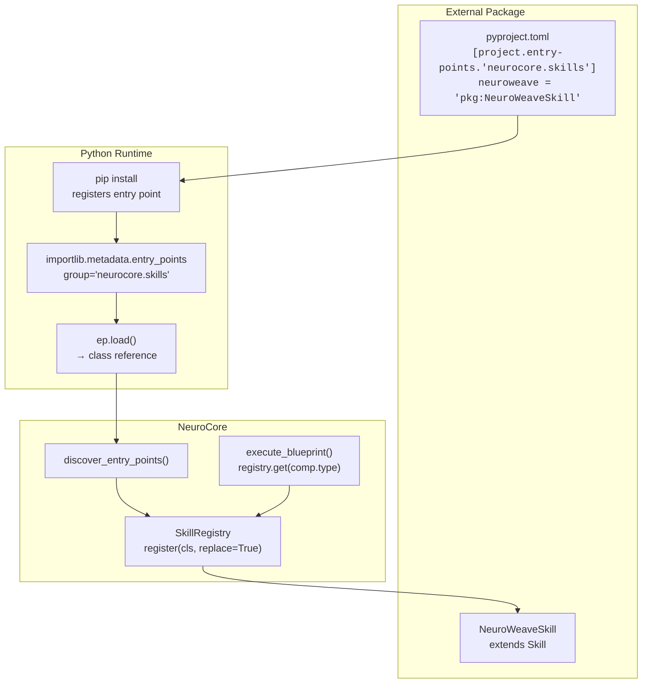
```mermaid
graph TD
    subgraph ExtPkg["External Package<br/><i>e.g. neurocore-skill-neuroweave</i>"]
        PT["pyproject.toml<br/><code>[project.entry-points.'neurocore.skills']</code><br/><code>neuroweave = 'pkg:NeuroWeaveSkill'</code>"]
        SC["NeuroWeaveSkill<br/>extends Skill"]
    end

    subgraph PyRuntime["Python Runtime"]
        PipInstall["pip install<br/>registers entry point"]
        EP["importlib.metadata.entry_points<br/>group='neurocore.skills'"]
        Load["ep.load()<br/>→ class reference"]
    end

    subgraph NC["NeuroCore"]
        Discover["discover_entry_points()"]
        Registry["SkillRegistry<br/>register(cls, replace=True)"]
        Executor["execute_blueprint()<br/>registry.get(comp.type)"]
    end

    PT --> PipInstall
    PipInstall --> EP
    EP --> Load
    Load --> Discover
    Discover --> Registry
    Executor --> Registry
    Registry --> SC
```

| Field | Value | Location |
|-------|-------|----------|
| Entry point group | `neurocore.skills` | `pyproject.toml` `[project.entry-points."neurocore.skills"]` |
| Entry point name | `neuroweave` (matches `skill_meta.name`) | Entry point key |
| Entry point target | `neurocore_skill_neuroweave:NeuroWeaveSkill` | `package_module:ClassName` |
| Registration mode | `replace=True` | Entry points override directory-discovered skills |

**Creating a skill plugin:**

1. Create a Python package with a `Skill` subclass and `skill_meta` class attribute
2. Add `[project.entry-points."neurocore.skills"]` to `pyproject.toml`
3. Declare `neurocore>=0.1.0` as a dependency
4. `pip install` the package — NeuroCore discovers it automatically via `neurocore skill list`

---

## 14. Component Interaction Matrix

Rows are source modules (importers). Columns are target modules (imported).
**X** = direct import, **L** = lazy import (inside function body), **T** = TYPE_CHECKING only.

| Module | `errors` | `config.defaults` | `config.schema` | `config.loader` | `skills.base` | `skills.registry` | `skills.loader` | `runtime.blueprint` | `runtime.executor` | `logging.setup` | `flowengine` | `typer` | `rich` | `pydantic` | `pyyaml` | `structlog` | `python-dotenv` |
|--------|:--------:|:-----------------:|:---------------:|:---------------:|:-------------:|:-----------------:|:---------------:|:-------------------:|:-----------------:|:---------------:|:------------:|:-------:|:------:|:----------:|:--------:|:-----------:|:---------------:|
| **cli/app.py** | | | | | | | | | | | | X | | | | | |
| **cli/init_cmd.py** | | | | | | | | | | | | X | X | | | | |
| **cli/run_cmd.py** | X | | | | | | | | L | | | X | X | | | | |
| **cli/skill_cmd.py** | X | | | L | | | L | | | | | X | X | | | | |
| **cli/validate_cmd.py** | X | | | L | | | L | L | | | | X | X | | | | |
| **runtime/executor.py** | X | | X | X | X | X | X | X | | | X | | | | | | |
| **runtime/blueprint.py** | X | | | | | X | | | | | | | | X | X | | |
| **skills/base.py** | X | | | | | | | | | | X | | | | | | |
| **skills/registry.py** | X | | | | X | | | | | | | | | | | | |
| **skills/loader.py** | X | | | | X | X | | | | | | | | | | | |
| **config/loader.py** | X | X | X | | | | | | | | | | | | X | | X |
| **config/schema.py** | | X | | | | | | | | | | | | X | | | |
| **logging/setup.py** | | | T | | | | | | | | | | | | | X | |

---

## 15. Key Design Decisions

| Decision | Choice | Rationale |
|----------|--------|-----------|
| Config format | YAML everywhere | Consistent with FlowEngine; single mental model |
| Config loading | pydantic-settings | Env var overlay for free, validation, type safety |
| CLI framework | Typer | Type-hinted, built on Click, Rich output for free |
| Logging | structlog | Structured from day one, matches NeuroWeave |
| Skill base class | Extends `BaseComponent` | Zero-cost FlowEngine integration; inherits lifecycle |
| Skill discovery | Directory + entry points | Local dev (directory) + pip-installable packages (entry points) |
| Skill precedence | Entry points > directory | Installed version wins over local development copy |
| NeuroWeave coupling | Separate skill package | NeuroCore stays memory-backend agnostic |
| LLM abstraction | `LLMProvider` protocol, injected | Skills declare `requires_llm=True`; one config picks the backend (Anthropic, OpenAI, Gemini, Ollama/vLLM/OpenAI-compatible, LiteLLM) |
| Local-model support | `openai-compatible`/`ollama`/`vllm` reuse `OpenAIProvider` | All speak the OpenAI wire format → one implementation, no extra deps |
| Persistence | `RunStore` interface, SQLite default | Durable run history without new deps; pluggable (Postgres/S3 later) |
| Checkpoint vs run | Separate `CheckpointStore` (transient) and `RunStore` (durable) | Different lifecycles; a RunStore can back a CheckpointStore for the sync path |
| Resume semantics | Async/DAG path re-runs from `completed_nodes`; sync path uses flowengine resume | Re-execute the suspended/failed step; skip what already finished |
| Human-in-the-loop | Built-in `ApprovalSkill` (async) + `approval:` sugar | Async forces the neurocore executor, which re-runs the gate with the decision |
| MCP | Optional `neurocore-skill-mcp` package | Keeps the `mcp` SDK out of core; discovered like any skill |
| Templates | Full project trees + registry | `neurocore new` scaffolds runnable starters; `init` stays the blank scaffold |
| Blueprint format | Standard FlowEngine YAML + `approval:` sugar | No new format to learn; full FlowEngine power |
| Async bridge | `asyncio.run()` in executor | CLI is sync; async skills run on the event loop |
| Type validation | `validate_types=False` | Components are pre-built by executor, not loaded by FlowEngine |
| Config merging | Shallow dict merge | Blueprint overlay wins; simple, predictable, debuggable |
| Lazy CLI imports | Inside function bodies | Fast `neurocore --help` startup; heavy modules loaded on demand |

---

## 16. LLM Provider Subsystem

Skills declare `requires_llm=True`; the executor builds a provider from the
merged config and injects it as `self.llm`. Providers implement the
`LLMProvider` protocol (`provider_name`, `model`, async `complete()`,
async-generator `stream()`).

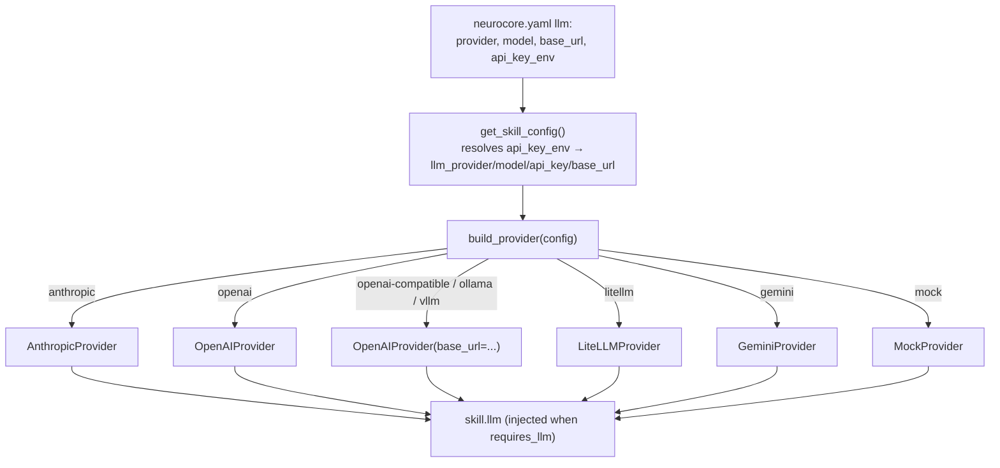
```mermaid
graph TD
    Cfg["neurocore.yaml llm:<br/>provider, model, base_url, api_key_env"] --> GSC["get_skill_config()<br/>resolves api_key_env →<br/>llm_provider/model/api_key/base_url"]
    GSC --> BP["build_provider(config)"]
    BP -->|anthropic| AP[AnthropicProvider]
    BP -->|openai| OP[OpenAIProvider]
    BP -->|"openai-compatible / ollama / vllm"| OPC["OpenAIProvider(base_url=...)"]
    BP -->|litellm| LL[LiteLLMProvider]
    BP -->|gemini| GP[GeminiProvider]
    BP -->|mock| MP[MockProvider]
    AP & OP & OPC & LL & GP & MP --> INJ["skill.llm (injected when requires_llm)"]
```

| `provider` | Class | Install | Notes |
|------------|-------|---------|-------|
| `anthropic` | `AnthropicProvider` | core | default `claude-sonnet-4-6` |
| `openai` | `OpenAIProvider` | `[openai]` | optional `base_url` |
| `openai-compatible` / `ollama` / `vllm` | `OpenAIProvider` | `[local]` | OpenAI wire format; `ollama`/`vllm` have default base URLs |
| `litellm` | `LiteLLMProvider` | `[litellm]` | routes by `model` |
| `gemini` | `GeminiProvider` | `[gemini]` | |
| `mock` | `MockProvider` | core | tests |

`api_key_env` is resolved from the environment at config-load time, keeping
providers env-agnostic and testable. See [docs/providers.md](docs/providers.md).

---

## 17. Persistence, Runs & Resume

`execute_blueprint_tracked()` wraps execution: it writes a `RUNNING` `RunRecord`,
records a `StepRecord` per step (and appends to `metadata.completed_nodes`), then
finalizes the run as `COMPLETED`, `FAILED`, or `SUSPENDED`.

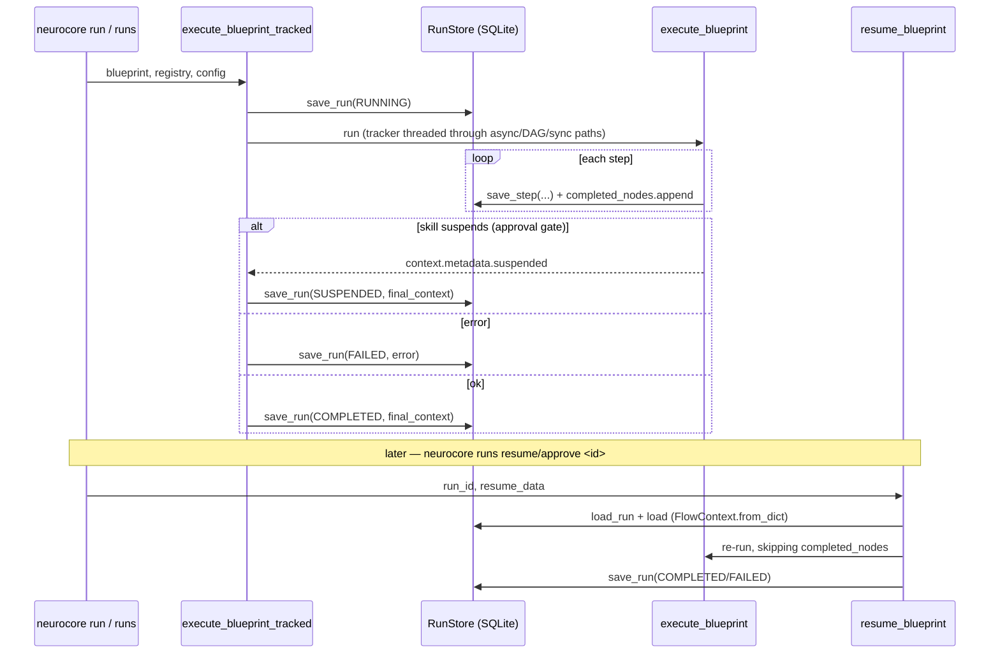
```mermaid
sequenceDiagram
    participant CLI as neurocore run / runs
    participant Tracked as execute_blueprint_tracked
    participant Store as RunStore (SQLite)
    participant Exec as execute_blueprint
    participant Resume as resume_blueprint

    CLI->>Tracked: blueprint, registry, config
    Tracked->>Store: save_run(RUNNING)
    Tracked->>Exec: run (tracker threaded through async/DAG/sync paths)
    loop each step
        Exec->>Store: save_step(...) + completed_nodes.append
    end
    alt skill suspends (approval gate)
        Exec-->>Tracked: context.metadata.suspended
        Tracked->>Store: save_run(SUSPENDED, final_context)
    else error
        Tracked->>Store: save_run(FAILED, error)
    else ok
        Tracked->>Store: save_run(COMPLETED, final_context)
    end

    Note over CLI,Resume: later — neurocore runs resume/approve <id>
    CLI->>Resume: run_id, resume_data
    Resume->>Store: load_run + load (FlowContext.from_dict)
    Resume->>Exec: re-run, skipping completed_nodes
    Resume->>Store: save_run(COMPLETED/FAILED)
```

- **Replay** (`runs replay`) re-executes from the stored `initial_data` as a new
  run. **Resume** (`runs resume`/`approve`) continues a `suspended`/`failed` run,
  skipping `completed_nodes`.
- The async/sequential and DAG paths persist `final_context` (a full
  `FlowContext.to_dict()`) as the checkpoint; the sync FlowEngine path uses a
  flowengine `Checkpoint` (linked via `RunRecord.checkpoint_id`).

See [docs/persistence-and-runs.md](docs/persistence-and-runs.md).

---

## 18. Human-in-the-Loop

The built-in `ApprovalSkill` (an `AsyncSkill`, always registered) suspends a run
until a human decides. The `approval:` blueprint step desugars to it during
`load_blueprint()`.

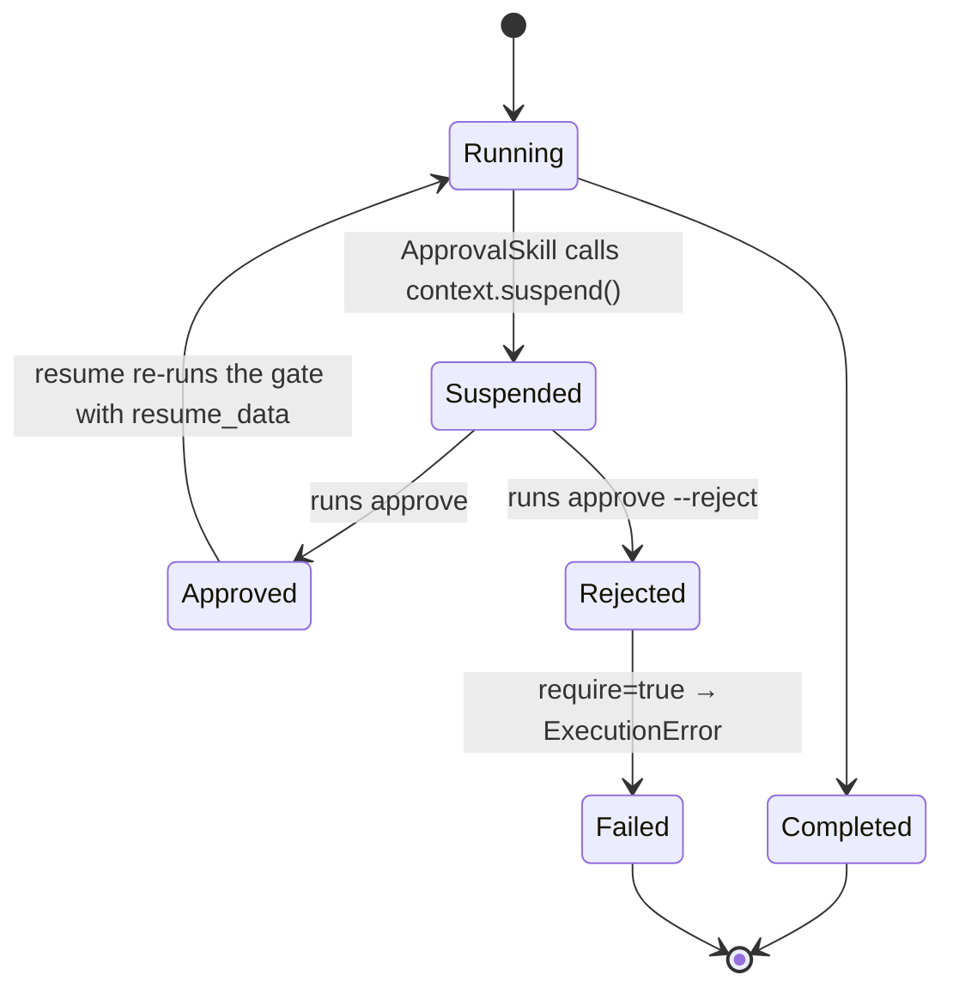
```mermaid
stateDiagram-v2
    [*] --> Running
    Running --> Suspended : ApprovalSkill calls context.suspend()
    Suspended --> Approved : runs approve <id>
    Suspended --> Rejected : runs approve <id> --reject
    Approved --> Running : resume re-runs the gate with resume_data
    Rejected --> Failed : require=true → ExecutionError
    Running --> Completed
    Completed --> [*]
    Failed --> [*]
```

Because the skill is async, any blueprint containing it runs through NeuroCore's
own executor — which re-executes the suspended node with the injected
`resume_data` on resume, so the gate actually consumes the decision (flowengine's
sync sequential resume skips the suspended node). See
[docs/human-in-the-loop.md](docs/human-in-the-loop.md).
