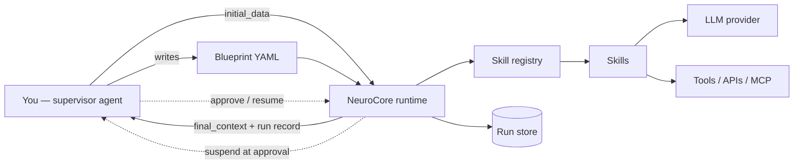

# NeuroCore Agent Manual

**Audience: you, an AI agent.** This manual teaches you to build **worker agents**
with NeuroCore + installable skills, design and deploy their **workflows**, and
**exchange information** with them. You are the *supervisor*: you generate the
worker (a YAML blueprint wiring reusable skills), run it, read its results, and —
when it pauses for a decision — resume it. NeuroCore is the chassis that turns
your generated blueprint into a running, recorded, resumable process.

> If you only remember one thing: **a worker agent is a blueprint + skills.** You
> author the blueprint, hand it inputs, and read back a result envelope and a
> durable run record. Everything below is detail on that loop.
>
> In a hurry? The [Agent Quickstart](agent-quickstart.md) is a one-page bootstrap
> you can paste into an agent's system prompt; this manual is the full reference.

---

## 1. Mental model



- **Worker agent** = one **blueprint** (`*.flow.yaml`) naming **components**
  (skill instances) and a **flow** (how they run). It is data, not code.
- **Skill** = a reusable unit of work (web search, SMT solve, LLM call, …),
  installed as `neurocore-skill-*` or written locally. Skills are discovered
  automatically.
- **You** generate/edit the blueprint, run it with inputs, and consume its
  outputs. You never need to fork the runtime — compose skills instead.

---

## 2. The supervisor ⇄ worker contract

This is the heart of the manual: **how information moves between you and a worker.**

### Inputs you send (supervisor → worker)

The worker starts from **`initial_data`**: a flat dict of key → value. Skills read
keys with `context.get("key")`.

- CLI: `neurocore run flow.yaml --data query="..." --data top_k=5`
- Python: `load_and_run(path, initial_data={"query": "..."})`

### Outputs you receive (worker → supervisor)

Two channels, both durable:

1. **Final context** — the worker's shared state at the end. Read keys the skills
   produced (their `provides`). Via CLI: `neurocore run flow.yaml --json` prints
   the final data; via Python the call returns a `FlowContext` (`result.get("answer")`).
2. **Run record** — every run is persisted (SQLite by default). It carries
   `status`, `final_context`, per-step history, errors, and suspension info.
   Inspect it later: `neurocore runs inspect <run_id> --full --json`.

### The skill result envelope

Marketplace/math skills write a **uniform envelope** under their `output_key`:

```json
{"status": "ok", "tool": "z3", "available": true,
 "result": {...}, "log": "", "error": null, "duration_ms": 12.4}
```

`status ∈ {ok, proved, refuted, unknown, tool_unavailable, error, timeout}`.
**Always check `status`** before trusting `result`. `tool_unavailable` means the
backend isn't installed — the worker degraded gracefully rather than crashing.

### Keys: the wiring contract

Each skill declares `consumes` (keys it reads) and `provides` (keys it writes).
You connect skills by **matching keys**, and you can remap any skill's I/O with
config `input_key` / `output_key`. Keys are flat strings; the convention uses
dotted namespaces (`math.normalized`, `evidence.sympy`, `counterexamples.z3`,
`proof.strategy`, `formal.lean_result`). They are *not* nested — `evidence.sympy`
is one literal key.

### Human-in-the-loop channel

A worker can **pause** for your decision (an `approval:` gate). The run becomes
`suspended`; you inspect it, then **approve/reject** to resume. See §6.

---

## 3. The build loop

Follow this loop every time you construct a worker:

```
discover skills → choose flow → write blueprint → validate → run → inspect → (resume) → iterate
```

1. **Discover** what's installed: `neurocore skill list` (names, versions, tags)
   and `neurocore skill info <name>` (consumes/provides/config schema). Build only
   from skills that exist (or author one — §9).
2. **Choose a flow** (§4): sequential for a pipeline; graph for branching/loops.
3. **Write the blueprint** (§4 schema).
4. **Validate** (no execution): `neurocore validate flow.yaml`. Fix unresolved
   skill references / structural errors before running.
5. **Run** with inputs (§2). Use `--stream` to watch progress.
6. **Inspect** the result + run record (§2). On failure, read the failed step's
   `error`. On `suspended`, decide (§6).
7. **Iterate**: edit the blueprint and re-validate. Use `neurocore runs replay
   <id>` to re-run from the same inputs.

---

## 4. Designing workflows

### Blueprint schema (author this)

```yaml
name: my-worker                 # required
version: "1.0"
description: "what this worker does"
components:                     # required, ≥1 — each is a skill instance
  - name: search                # instance name (used in flow + as default keys)
    type: tavily                # a registered skill name (neurocore skill list)
    config: {max_results: 5}    # merged over neurocore.yaml skills.<type>; wins
flow:
  type: sequential              # sequential | conditional | graph
  steps:                        # sequential/conditional
    - component: search
    - component: summarize
```

### Sequential pipeline

Runs each step in order, threading one `FlowContext`. Use it for linear
"do A then B then C" workers. Add an `approval:` step anywhere (§6).

### Graph: branching, loops, fan-out

Use `flow.type: graph` with `nodes` + `edges` when control flow isn't linear:

```yaml
flow:
  type: graph
  settings: {max_iterations: 4, on_max_iterations: exit, timeout_seconds: 600}
  nodes:
    - {id: classify, component: classify}
    - {id: research, component: research}
    - {id: report,   component: report}
  edges:
    - {source: classify, target: research, port: needs_research}
    - {source: classify, target: report,   port: trivial}
    - {source: research, target: report}
```

**Routing rules an agent must know:**

- **Ports** — a skill sets an *active output port* (e.g. `counterexample_found`).
  An edge with `port: X` fires only when the source set port `X`; `port: null`
  (omitted) is unconditional. This is how you branch.
- **Conditions** — an edge may carry `condition:` (a safe Python expression over
  `context`, e.g. `context.data.score > 0.5`). The edge fires only if the
  condition is True. ⚠️ Use **attribute access** (`context.data.x`), not
  `context.get(...)` (function calls are disallowed). For dotted keys use
  subscript: `context.data['evidence.sympy']`. An edge activates when **port
  matches AND condition holds**.
- **Cycles / loops** — edges may form a cycle (e.g. a check→repair→check loop).
  You **must** set `settings.max_iterations` and should set
  `on_max_iterations: exit` plus an explicit exit port, or the worker errors.
- **Reachability** — a node runs only if an incoming edge activated it; root
  nodes (no incoming edge) always run. Independent nodes may run concurrently.

**Hybrid execution (why it matters):** NeuroCore routes a graph through
flowengine's `GraphExecutor` automatically when it uses ports, conditions, or
cycles (so those are honored). Plain DAGs with none of these run on the
concurrent layer executor. You don't choose this — just know that ports and
conditions *work*. (Requires `neurocore-ai>=0.4.0` / `flowengine>=0.6.0`.)

### Reusable workflow patterns

- **Classify-then-route** — a classifier sets a port; edges fan out to
  domain-specific branches.
- **Counterexample-first** — run refutation (SMT/property tests) *before*
  expensive proof/generation; an edge `port: counterexample_found → report`
  exits early. (Cheaper to disprove than to prove.)
- **Generate → verify → repair loop** — `generate → check`; on
  `port: repair_needed → repair → check` (a cycle, bounded by `max_iterations`);
  on `port: verified → report`.
- **Fan-out / fan-in** — `normalize` → many independent explorers → a single
  `report` that aggregates all their envelopes.
- **Approve-before-act** — insert an `approval:` gate before any irreversible
  step (§6).

---

## 5. Exchanging information — details & idioms

- **Seed inputs** at the keys the first skills consume. Check `skill info` for
  exact `consumes` keys, or set them explicitly with `input_key`.
- **Chain skills** by pointing a downstream skill's `input_key` at an upstream
  `output_key`. Remember most skills wrap output in an **envelope**; if a
  downstream skill needs the inner value, either (a) use a skill that reads the
  envelope's `result`, or (b) have the producing skill write a plain value to a
  shared key (e.g. normalizers write `math.normalized`).
- **Aggregate** at the end with a reporter skill (e.g.
  `proof_report_builder`) that scans all envelopes and emits a verdict +
  artifacts.
- **Read results programmatically:**

  ```python
  from neurocore.runtime.executor import load_and_run
  ctx = load_and_run(Path("flow.yaml"), initial_data={"query": "..."})
  answer = ctx.get("answer")                 # a provided key
  if ctx.metadata.suspended: ...             # paused for approval
  ```

- **Read run history** (for audit / multi-turn): `neurocore runs inspect <id>
  --json` returns the full `RunRecord` + `StepRecord`s (status, durations,
  output_keys, errors) — ideal for you to reason about what happened.

---

## 6. Human-in-the-loop (approval gates)

Insert a gate so a worker pauses for a human (or you) before a risky/irreversible
action. Use the `approval:` step sugar:

```yaml
flow:
  type: sequential
  steps:
    - component: draft_email
    - approval: {name: human_review, message: "Send this?", require: true}
    - component: send_email
```

Lifecycle:

1. Run reaches the gate → **suspends**; the run is saved with status `suspended`.
2. Find pending decisions: `neurocore runs list --status suspended`.
3. Decide:
   - `neurocore runs approve <run_id> --by you@example.com` → resumes from the gate.
   - `neurocore runs approve <run_id> --reject --note "too risky"` → with
     `require: true`, the run ends `failed`.
4. The decision (`{approved, note, by}`) is written to the `approval` context key
   for downstream skills.

Programmatically: `resume_blueprint(run_id, registry, config,
resume_data={"approved": True})`. Failed runs can also be resumed (they re-run
from the failed step; completed steps are skipped).

---

## 7. Providers — give a worker an LLM

Any skill with `requires_llm=True` receives an injected `self.llm`. Configure it
once in `neurocore.yaml`:

```yaml
llm:
  provider: anthropic     # anthropic|openai|gemini|ollama|vllm|openai-compatible|litellm|mock
  model: claude-sonnet-4-6
  api_key_env: ANTHROPIC_API_KEY     # name of the env var holding the key
  # base_url: http://localhost:11434/v1   # for ollama/vllm/openai-compatible
```

- **Local, no cloud key:** `provider: ollama` (default `base_url`
  `http://localhost:11434/v1`) or any `openai-compatible` endpoint — install with
  `pip install "neurocore-ai[local]"`.
- **Tests / dry runs:** `provider: mock` returns deterministic text (no network).

Per-skill overrides go under `skills.<name>` in `neurocore.yaml` or a component's
`config`.

---

## 8. Skill catalog — your building blocks

Run `neurocore skill list` for the authoritative, installed set. Commonly available:

| Skill `type` | Package | Consumes → provides |
|--------------|---------|---------------------|
| `approval` | built-in | (suspends) → `approval` |
| `tavily` / `brave` | `neurocore-skill-{tavily,brave}` | `*_query` → `*_results` |
| `wolfram` | `neurocore-skill-wolfram` | `wolfram_query` → `wolfram_result` |
| `qdrant` | `neurocore-skill-qdrant` | `query_vector` → `qdrant_results` |
| `postgres` | `neurocore-skill-postgres` | `sql` → `postgres_rows` |
| `ollama` | `neurocore-skill-ollama` | `prompt` → `ollama_response` |
| `telegram` | `neurocore-skill-telegram` | `telegram_text` → `telegram_result` |
| `mcp-tool` | `neurocore-skill-mcp` | `mcp_arguments` → `mcp_result` |
| math toolchain (24 types) | `neurocore-skill-math` | see its README |

Install capabilities on demand: `pip install neurocore-skill-tavily` → it appears
in `skill list` automatically (entry-point group `neurocore.skills`).

**MCP** lets a worker call any Model Context Protocol server tool via a `mcp-tool`
component (`pip install neurocore-skill-mcp`); list a server's tools with
`neurocore mcp list-tools --command ... --args ...`.

---

## 9. Authoring a custom skill (when nothing fits)

Prefer a marketplace skill. If none fits, drop a file in the project's `skills/`:

```python
# skills/score.py
from flowengine import FlowContext
from neurocore import AsyncSkill, SkillMeta

class ScoreSkill(AsyncSkill):
    skill_meta = SkillMeta(
        name="score", version="0.1.0",
        description="Score a candidate answer.",
        requires_llm=True,                # inject self.llm
        consumes=["answer"], provides=["score"],
        config_schema={"properties": {"threshold": {"type": "number"}}},
        max_retries=2,                    # exponential backoff on failure
    )

    async def process(self, context: FlowContext) -> FlowContext:
        # read inputs, do work, write outputs, optionally set a port
        context.set("score", 0.9)
        self.set_output_port(context, "high")   # for graph routing
        return context
```

Rules for skills you generate:
- Implement `process(context) -> context` (use `AsyncSkill` for I/O).
- Read with `context.get`, write with `context.set`. Never crash the flow —
  catch tool errors and write an error result instead.
- Declare accurate `consumes`/`provides`; set ports to drive graph routing.
- Reference it in a blueprint by `skill_meta.name`. To publish it as a package,
  follow the `neurocore.skills` entry-point convention (see the skill-authoring
  guide).

---

## 10. Deploying a worker

- **Scaffold a project:** `neurocore new <template> <name>` (templates:
  `rag-agent`, `research-agent`, `ollama-agent`, `multi-agent-debate`,
  `tool-agent`); `neurocore new --list`. Layout:

  ```
  my-agent/
    neurocore.yaml        # provider, persistence, paths, per-skill config
    blueprints/*.flow.yaml
    skills/               # local custom skills
    data/  logs/
  ```

- **Persistence** (run history) is on by default (SQLite at `data/runs.db`).
  Configure in `neurocore.yaml`:

  ```yaml
  persistence: {enabled: true, backend: sqlite, path: runs.db}
  ```

- **Containers:** the repo ships a `Dockerfile` and an example
  `docker-compose.yaml` (NeuroCore + Ollama + Qdrant) for self-hosted workers.
- **Secrets:** never inline keys; use `api_key_env` + environment variables / `.env`.

---

## 11. Operating workers — command & API reference

CLI (run with `-p <project>` if not inside the project dir):

```bash
neurocore skill list                       # discover building blocks
neurocore skill info <name>                # a skill's consumes/provides/config
neurocore validate blueprints/flow.yaml    # structural + skill-reference check
neurocore run blueprints/flow.yaml --data query="..." [--stream] [--json]
neurocore runs list [--status suspended] [--blueprint NAME] [--limit N]
neurocore runs inspect <run_id> [--full] [--json]
neurocore runs replay <run_id>             # re-run from original inputs (new run)
neurocore runs resume <run_id> [--data k=v ...]
neurocore runs approve <run_id> [--reject] [--note "..."] [--by who]
neurocore mcp list-tools --command ... --args ...
```

Python (when orchestrating in-process):

```python
from neurocore.runtime.executor import (
    load_and_run, execute_blueprint_tracked, resume_blueprint,
)
from neurocore.config.loader import load_config
from neurocore.skills.loader import discover_skills
from neurocore.runtime.blueprint import load_blueprint
from neurocore.persistence import build_run_store, RunStatus

ctx = load_and_run(Path("flow.yaml"), initial_data={"query": "..."})  # runs + records
store = build_run_store(load_config())
for run in store.list_runs(status=RunStatus.SUSPENDED):
    resume_blueprint(run.run_id, discover_skills(load_config()), load_config(),
                     resume_data={"approved": True}, run_store=store)
```

---

## 12. Rules & best practices (checklist)

When you build a worker, follow these:

1. **Only reference skills that `skill list` shows.** Validate before running.
2. **Wire by keys.** Confirm each consumer's `input_key` matches a producer's
   `output_key`; check `skill info`.
3. **Check `status` in every envelope.** Treat `tool_unavailable`/`error`/
   `timeout` as non-results; branch on them if it matters.
4. **Gate irreversible actions** (send/delete/deploy/pay) behind an `approval:`
   step.
5. **Refute before you prove/generate.** Put counterexample/validation search
   early; exit on `counterexample_found`.
6. **Bound loops.** Any cycle needs `settings.max_iterations` + `on_max_iterations`.
7. **Trust only verified status.** In proof/verification workers, treat formal
   checker `verified` as truth; CAS/SMT/ATP/LLM outputs are *evidence*.
8. **Keep skills idempotent & side-effect-light**; let the runtime handle retries
   (`max_retries`) and persistence.
9. **Read the run record, not just the final value**, when you need to reason
   about *how* the worker got there (steps, errors, durations).
10. **Prefer marketplace skills**; author a custom skill only when none fits.

---

## 13. Worked examples

### A. Research worker (sequential, supervisor reads the answer)

```yaml
name: research-worker
components:
  - {name: search, type: tavily, config: {max_results: 5}}
  - {name: summarize, type: summarize}     # a local requires_llm skill
flow:
  type: sequential
  steps: [{component: search}, {component: summarize}]
```

```bash
neurocore run blueprints/research.flow.yaml --data tavily_query="Riemann hypothesis progress" --json
# supervisor reads the "answer" key from the JSON
```

### B. Verify-and-repair worker (graph, ports + bounded loop)

```yaml
flow:
  type: graph
  settings: {max_iterations: 3, on_max_iterations: exit}
  nodes:
    - {id: gen, component: lean4_formalize_statement}
    - {id: chk, component: lean4_check}
    - {id: fix, component: lean4_repair}
    - {id: rep, component: proof_report_builder}
  edges:
    - {source: gen, target: chk}
    - {source: chk, target: rep, port: verified}
    - {source: chk, target: fix, port: repair_needed}
    - {source: fix, target: chk, port: repaired}
    - {source: chk, target: rep, port: failed}
```

The supervisor seeds `math.normalized`, runs it, then reads `validation_status`
and `proof_artifacts`. (See `neurocore-skill-math` for the full proof worker.)

### C. Approval worker (suspend ⇄ resume)

```bash
neurocore run blueprints/approve.flow.yaml --data topic="delete prod DB"
# → status suspended
neurocore runs list --status suspended
neurocore runs approve <run_id> --by alexh@scrtlabs.com      # or --reject
```

---

You now have everything to build, wire, deploy, and operate NeuroCore worker
agents — and to exchange inputs, outputs, run records, and approval decisions
with them. Start from `neurocore skill list` and the build loop in §3.
