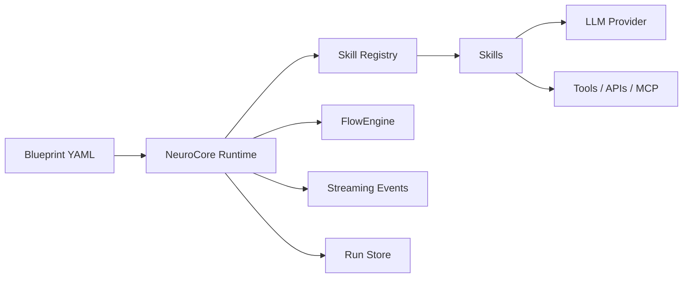

# Concepts

NeuroCore has a small set of orthogonal concepts. Learn these five and you can
read any project.

## Blueprint

A **blueprint** is a YAML file describing *what* to run. It lists `components`
(named skill instances) and a `flow` (how they connect). Flows are
`sequential`, `conditional`, or `graph` (a concurrent DAG).

```yaml
name: research-flow
components:
  - name: search
    type: tavily        # a skill registered under this name
    config: { max_results: 5 }
  - name: summarize
    type: summarize
flow:
  type: sequential
  steps:
    - component: search
    - component: summarize
```

## Skill

A **skill** is a reusable unit of work — a Python class extending `Skill` or
`AsyncSkill`. It declares a `SkillMeta` (name, `provides`/`consumes` context
keys, `config_schema`, `requires_llm`, retry policy) and implements
`process(context) -> context`. Skills are discovered from your `skills/`
directory or from installed `neurocore-skill-*` packages.

## Context

A **`FlowContext`** is the shared state threaded through a run. Skills read with
`context.get(key)` and write with `context.set(key, value)`. `provides` and
`consumes` in `SkillMeta` document the keys a skill produces and reads.

## Provider

An **LLM provider** is injected into any skill with `requires_llm=True`. Configure
it once in `neurocore.yaml` (`llm.provider`, `model`, `base_url`, `api_key_env`)
and every LLM skill gets a ready-to-use `self.llm`. See [Providers](providers.md).

## Run

A **run** is one execution of a blueprint. When persistence is enabled (default),
each run and its steps are recorded so you can `list`, `inspect`, `replay`, and
`resume` them. See [Persistence & runs](persistence-and-runs.md).

## How they fit together


